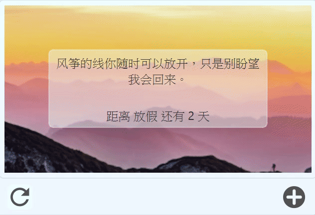

# Desktop Assistant
桌面助手

SD Desktop Assistant 是一个基于 Qt 的桌面助手应用，提供天气预报、每日格言、重要日期提醒和备忘录管理等功能。应用使用 SQLite 数据库存储数据，并通过网络 API 获取实时信息。

## 项目概述

- **技术栈**：Qt (C++), SQLite, QNetworkAccessManager
- **功能亮点**：实时天气、随机格言与图片、日期提醒、备忘录管理
- **适用平台**：Windows (可扩展)
- **组织名称**：MyOrg
- **应用名称**：sd-desktop-assistant

应用界面简洁，支持无边框窗口、自定义标题栏和拖拽移动。数据存储在本地，确保隐私和离线可用性。

## 特性

- **天气模块**：显示当前天气和未来 4 天预报，支持手动刷新。数据来源于和风天气 API。
- **格言与重要日模块**：随机显示励志格言和图片，支持添加/编辑重要日期，并计算距离天数。
- **备忘录模块**：支持添加、编辑、删除备忘录，最多显示前 3 条记录，双击查看详情。
- **数据库管理**：使用单例模式管理 SQLite 连接，支持外键约束和自动建表。
- **UI 优化**：圆角窗口、阴影效果、加载动画和 QSS 样式表。

## 截图

以下是应用的主要界面截图。

### 主界面
  

### 天气模块
  

### 格言与重要日模块
  

### 重要日管理界面
  

### 备忘录管理界面
  

（如果有更多截图，如对话框或编辑界面，请在下方添加类似格式的 Markdown 图片嵌入，例如：  
  
<!-- 请上传其他图片到 images/ 目录，并命名为 other_screenshot.png -->）

## 使用指南

1. **启动应用**：运行可执行文件，自动加载天气和格言数据。
2. **天气刷新**：点击天气模块的更新按钮。
3. **添加重要日期**：点击格言模块的 "+" 按钮，输入标题和日期。
4. **管理备忘录**：点击备忘录模块的 "+" 按钮添加，双击列表项编辑/查看。
5. **数据库位置**：数据存储在 `%APPDATA%/MyOrg/sd-desktop-assistant/data.db`。

**注意**：网络功能需要互联网连接。日期计算基于当前年份，自动处理闰年。

## 贡献指南

欢迎贡献！请遵循以下步骤：
1. Fork 仓库。
2. 创建特性分支 (`git checkout -b feature/AmazingFeature`)。
3. 提交更改 (`git commit -m 'Add some AmazingFeature'`)。
4. 推送到分支 (`git push origin feature/AmazingFeature`)。
5. 打开 Pull Request。

确保代码完整，包括输入验证和边界检查。

## 许可证

本项目采用 MIT 许可证。详情见 [LICENSE](LICENSE) 文件。

---

如果您有问题或建议，请在 Issues 中提出。感谢使用 Desktop Assistant！ 🚀
